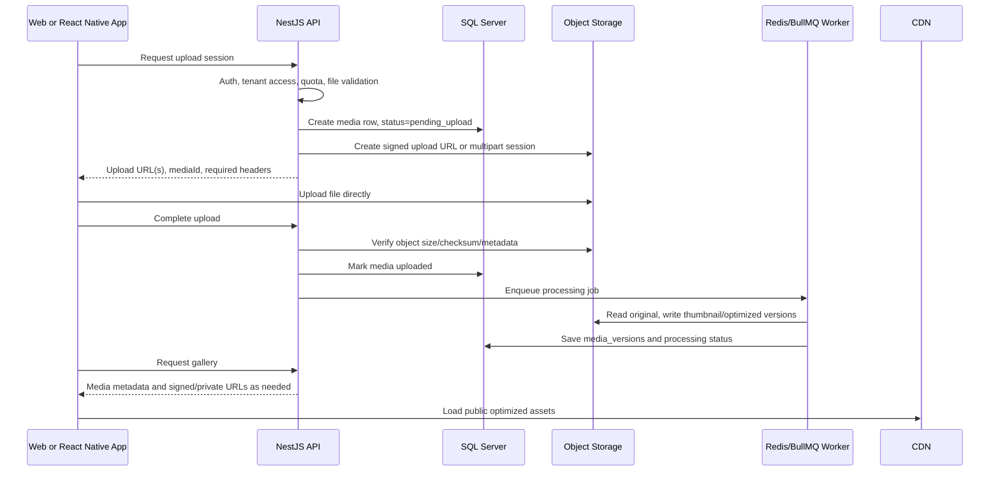

# Storage Strategy

## Decision

The Wedding uses app-managed media storage. The storage system must support web today and React Native iOS/Android later without changing album/media domain rules.

Recommended long-term direction:

- Local development: filesystem storage through the existing `StorageService` boundary.
- Production: S3-compatible object storage with private buckets, signed URLs, CDN for public optimized media, and background processing for thumbnails/video variants.
- Mobile: direct-to-object-storage uploads through API-created signed upload sessions, with resumable multipart uploads for large files.

Keep the provider replaceable. Cloudflare R2, AWS S3, MinIO, or another S3-compatible provider should all fit behind the same infrastructure adapter.

## Local Development

Use the current defaults:

```env
STORAGE_PROVIDER=local
LOCAL_STORAGE_PATH=./storage
```

When the API is started from `apps/api`, the default path resolves to:

```txt
D:\AJT\TheWedding\apps\api\storage
```

The folder is local runtime data and must never be committed. The repository ignores `/apps/api/storage/`.

## Production Target Architecture



## Upload Flow

### MVP Web Upload

Phase 4 can upload through the API to local storage for speed of implementation:

1. Client posts multipart form data to `POST /api/v1/media/upload`.
2. API validates auth, tenant membership, MIME type, extension, size, and album access.
3. API writes the file through `StorageService`.
4. API stores metadata in `media` and creates initial `media_versions` records where applicable.

This keeps local development simple while preserving the storage abstraction.

### Scale Upload for Web and Mobile

For production and React Native:

1. Client calls `POST /api/v1/media/upload-sessions`.
2. API creates a `pending_upload` media row and returns a signed upload URL.
3. Client uploads directly to object storage.
4. Client calls `POST /api/v1/media/upload-sessions/:id/complete`.
5. API verifies the object and queues processing.

Use single signed PUT for small files. Use multipart upload for large videos or unreliable mobile networks, because failed parts can be retried independently.

## Mobile Requirements

React Native iOS/Android should not send large media through the API process in production.

Mobile upload requirements:

- API-issued upload sessions, never provider secrets in the app.
- Progress reporting and cancel/retry.
- Multipart/resumable upload for large videos.
- Background-safe queue in the mobile app where possible.
- Idempotent complete endpoint, so retrying after app restart does not create duplicate media.
- Upload state stored locally on device until complete.
- Server-side verification of size, MIME, checksum, tenant access, and quota.

## Key Layout

Storage keys must be generated by the backend. Never trust user filenames for paths.

Recommended shape:

```txt
tenants/{tenantId}/media/{mediaId}/original/{random}.{ext}
tenants/{tenantId}/media/{mediaId}/versions/thumb_{width}.{ext}
tenants/{tenantId}/media/{mediaId}/versions/optimized_{width}.{ext}
tenants/{tenantId}/media/{mediaId}/versions/video_preview.{ext}
```

Store original display names in the database only:

- `originalFileName`: user-facing name.
- `storedFileName` or `storageKey`: backend-controlled key.
- `storageProvider`: local, s3, r2, etc.
- `publicUrl`, `thumbnailUrl`, `optimizedUrl`: optional cached delivery URLs. Prefer deriving signed URLs at runtime for private media.

## Privacy and Access

- Originals are private by default.
- Private and password-protected tenant media should be served through signed URLs with short TTLs.
- Public galleries may use CDN URLs for optimized derivatives, not original files.
- Download of originals must check tenant, album, media visibility, and `allowDownload`.
- Bucket names, provider credentials, and raw object storage keys must not leak into public API responses unless the URL is intentionally signed or public.

## Processing

Phase 7 should add workers for:

- Image thumbnail generation.
- Image optimization and responsive sizes.
- Video preview image or short preview clip.
- Blur placeholder/hash.
- EXIF cleanup where needed.
- Virus/malware scanning if uploads become public-facing at scale.
- Storage usage accounting updates.

Processing must be idempotent. Re-running a job should not corrupt existing media records.

## Provider Recommendation

Default implementation target: S3-compatible adapter.

Provider choice:

- Cloudflare R2 is a strong default if the app uses Cloudflare CDN and wants S3-compatible APIs with simple global delivery.
- AWS S3 is a strong default if the production stack already lives in AWS or needs deeper AWS ecosystem integrations.
- MinIO is useful for local or self-hosted S3-compatible testing.

The application should not depend on provider-specific domain logic. Keep provider details in `infrastructure`.

## Environment Plan

Current local variables:

```env
STORAGE_PROVIDER=local
LOCAL_STORAGE_PATH=./storage
```

Future production variables should be added when the S3-compatible adapter is implemented:

```env
STORAGE_PROVIDER=s3
S3_ENDPOINT=
S3_REGION=
S3_BUCKET=
S3_ACCESS_KEY=
S3_SECRET_KEY=
STORAGE_PUBLIC_BASE_URL=
STORAGE_SIGNED_URL_TTL_SECONDS=900
MAX_UPLOAD_BYTES=
MAX_VIDEO_UPLOAD_BYTES=
```

Do not commit real credentials.

## Phase Plan

### Phase 4

- Implement local storage adapter.
- Upload through API for MVP.
- Store provider/key metadata in SQL Server.
- Validate file type, extension, size, tenant access, and download permissions.
- Keep `StorageService` provider-neutral.

### Phase 7

- Add processing queue and media versions.
- Add thumbnails, optimized images, video preview, retryable jobs, and storage usage updates.

### Phase 8

- Add backup/retention policy, upload rate limits, abuse monitoring, file scanning, and disaster recovery docs.

### Phase 9

- Add S3-compatible production adapter.
- Add signed upload/download URLs.
- Add CDN for public optimized assets.
- Add multipart upload sessions for large mobile uploads.
- Add migration tooling from local storage to object storage if needed.
